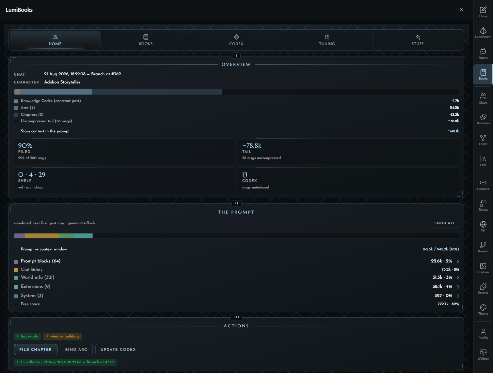
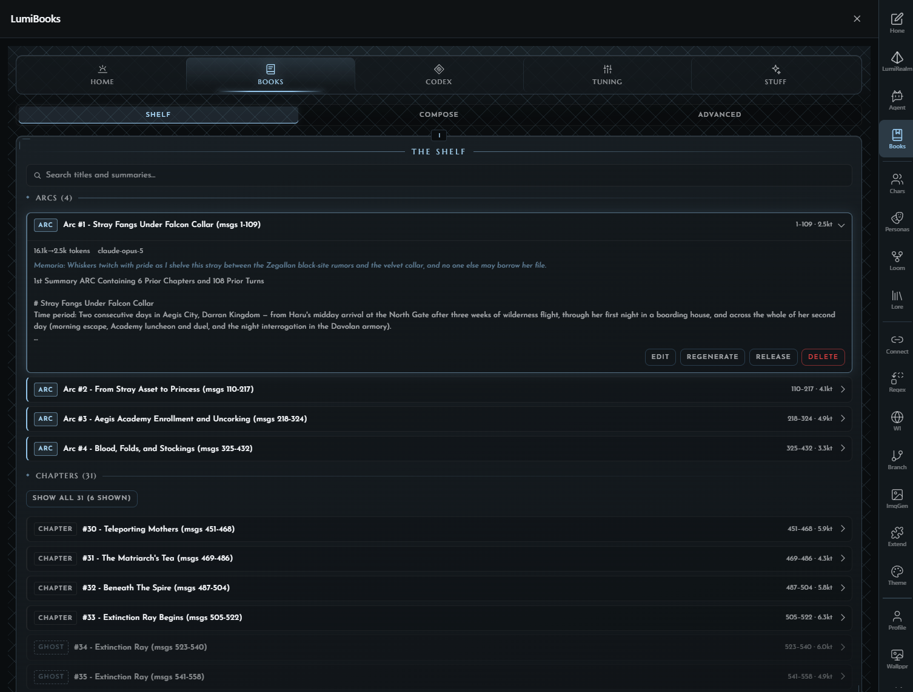
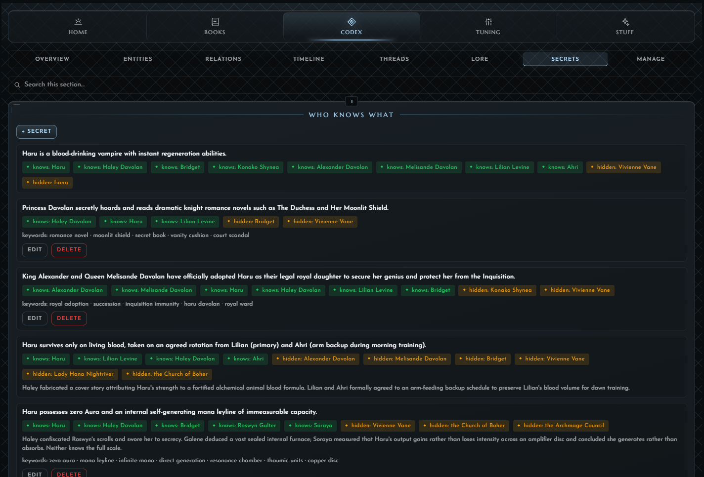
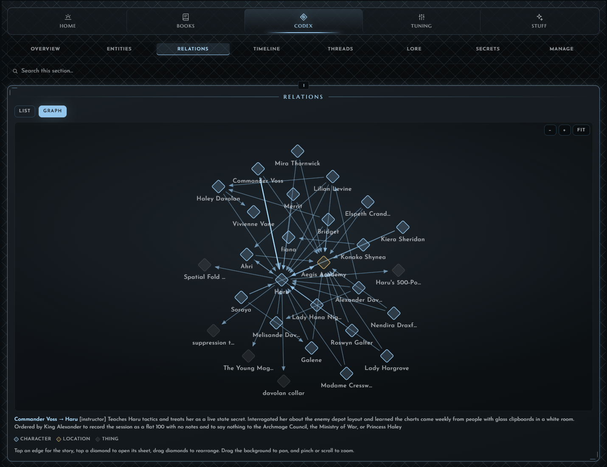
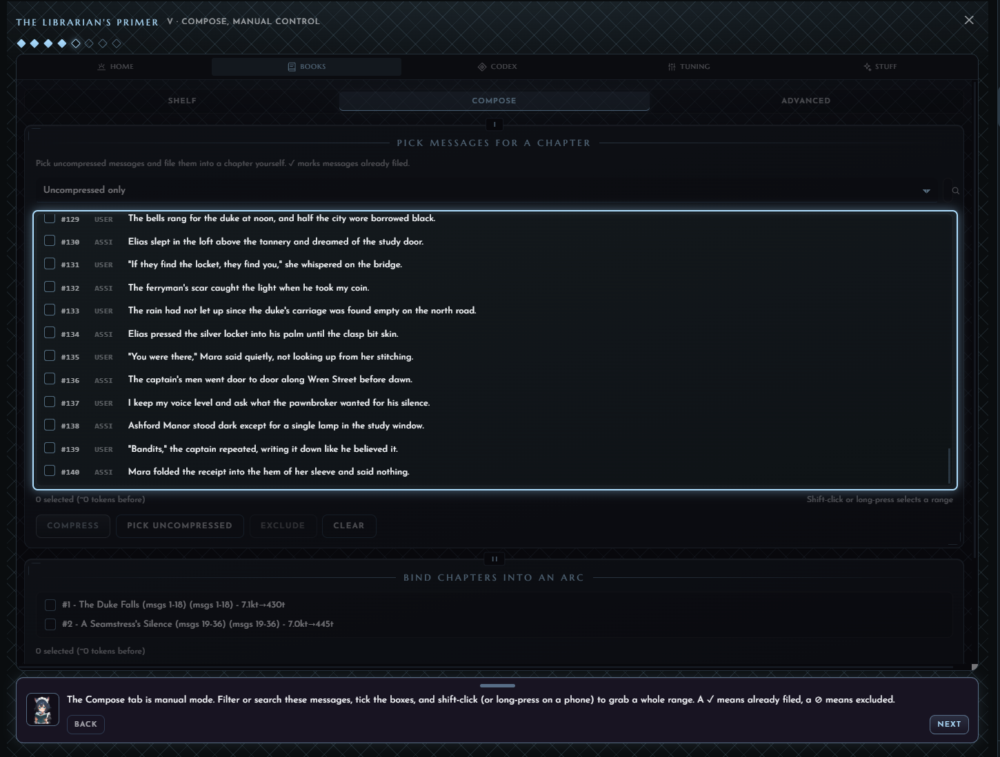
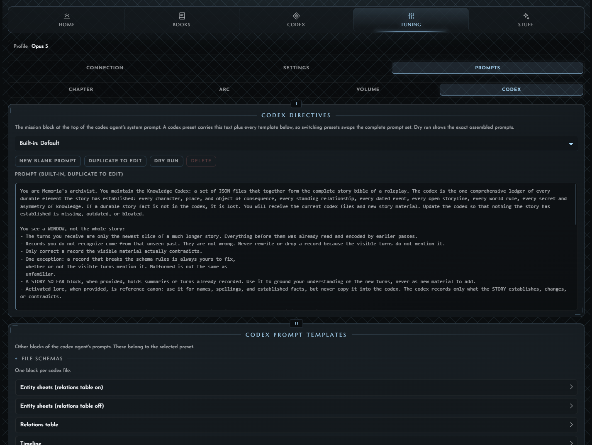
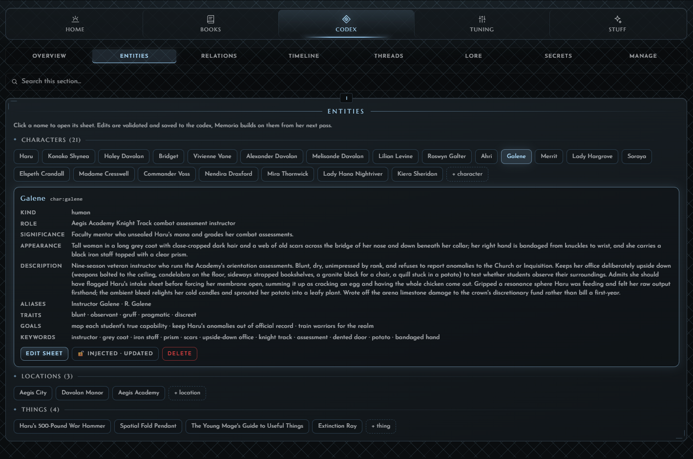
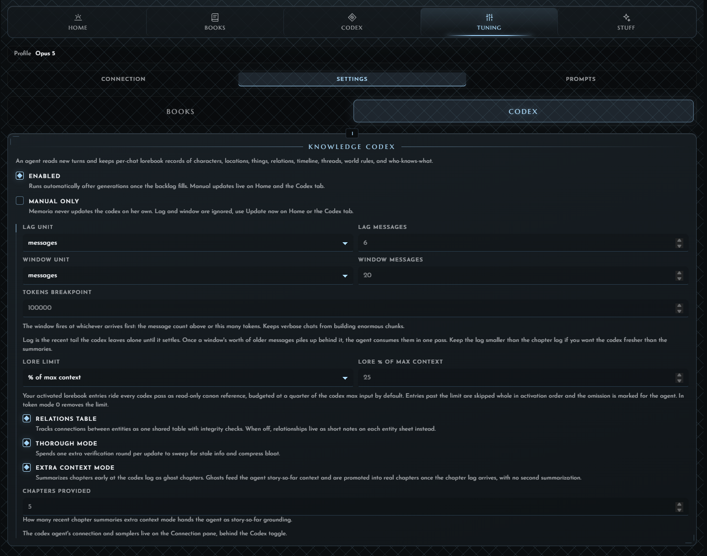

[](LICENCE)
[](https://github.com/prolix-oc/Lumiverse)
[](https://www.typescriptlang.org/)
[](https://bun.sh)

</div>

---

"Nyaa~ I'm Memoria, the LumiBooks librarian.

⚰️ When your chat grows long, I compact the older messages into **chapters** and slot them back into the prompt where they used to be. Pile up enough chapters and I compact them into an **arc**, then shelve the chapters. **These live and activate like lorebooks, but they replace the chat messages in place.** 

📮 I can also automatically track entities, relations, lore, secrets, and more for important parts of your story that you don't want compacted away! Displayed beautifully, and fully editable <3.

📝 I have an in-app tutorial covering everything! No need to read on here~

🐭 By the way, my big sister is [LumiAgent](https://github.com/AMousePad/LumiAgent). She's the chatty one."

| Home | Books Summaries |
| --- | --- |
|  |  |

| Relation Graph | Secrets |
| --- | --- |
|  |  |

| Tutorial | Prompt Presets |
| --- | --- |
|  |  |

| Entity Tracking | In-Depth Automation |
| --- | --- |
|  |  |

## What it does

- **Chapter compression** - Memoria auto-files the oldest messages into a compressed chapter.
- **Arc consolidation** - Many chapters bind into a single arc, slow-growing (up to 99% context reduction past a certain point)
- **Splice in place** - Compressed text replaces the original messages inside the prompt at the same position.
- **Entity, Relations, Lore, Secrets, Timeline tracking!** - Optional fully autonomous tracking for important parts of your story that you don't want compacted away. Displayed beautifully, and fully editable.
- **World book storage** - Every chapter and arc is an editable entry in an auto-created world book.
- **STMB prompts** - Default prompts are SillyTavern Memory Books' prompts. STMB preset exports import directly.
- **Custom prompts** - Save your own and switch profiles freely.
- **Regex hooks** - Outgoing regex runs on the prompt before Memoria reads. Incoming regex runs on the output after Memoria writes.

## Installation

LumiBooks installs as a Lumiverse extension. Lumiverse must be at version **1.1.6 or later.**

1. Open your Lumiverse instance.
2. Go to the **Sidebar - Extensions Tab** and add:

   ```txt
   https://github.com/AMousePad/LumiBooks
   ```
3. Grant the permissions.
4. Enable the extension. The **LumiBooks** tab appears in the sidebar.

## Acknowledgements

Memoria thanks the SillyTavern Memory Books authors [aikohanasaki](https://github.com/aikohanasaki). The default prompts and the broader workflow draw heavily on STMB.

<p align="right">(<a href="#readme-top">back to top</a>)</p>
